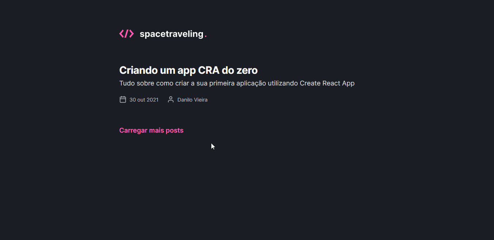

<div align="center">
  
</div>

## 📄 About

The main idea is to create a blog from scratch, using Next.JS, consuming data from Prismic CMS and have the interface according to the Figma layout.

Layout on Figma: [spacetraveling](https://www.figma.com/file/36aALGsnCtamC0u10P1Wjy/Desafios-M%C3%B3dulo-3-ReactJS-(Copy)/duplicate)

### Base Features

- Global stylizations, common individuals;
- Import fonts from Google Fonts;
- Pagination of posts;
- Estimated post reading time calculation;
- Generation of static pages with `getStaticProps` and `getStaticPaths` methods;
- Date formatting with `date-fns`;
- Use of icons with `react-icons`;
- HTTP requests with `fetch`;
- Between others.

The project is a challenge from the [Ignite Journey by Rocketseat](https://www.rocketseat.com.br/ignite).



## 🧪 Technologies
- [ReactJS](https://reactjs.org/)
- [TypeScript](https://www.typescriptlang.org/)
- [Next.js](https://nextjs.org/)
- [Prismic CMS](https://prismic.io/)
- [Node.JS](https://nodejs.org/en/)
- [Sass](https://sass-lang.com/)
- [React Icons](https://react-icons.github.io/react-icons/)
- [date-fns](https://date-fns.org/)

## 💻 Running

To run the app, you must have installed:
- [Node.JS](https://nodejs.org/en/)
- [NPM](https://www.npmjs.com/) or [Yarn](https://yarnpkg.com/)

And an account on - [Prismic CMS](https://prismic.io/).

You need to create the `.env.local` file and add the key: `PRISMIC_API_ENDPOINT="Your Prismic API Endpoint"`.
```bash
  # Clone the repository
  $ git clone https://github.com/gjoao11/spacetraveling.git
  
  # Enter the repository
  $ cd spacetraveling
  
  # Install the dependencies
  $ yarn
  
  # Run the app
  $ yarn dev
  
  # Navigate to `http://localhost:3000`
```

## 📝 License
This project is under the MIT license. See the [LICENSE](https://github.com/gjoao11/spacetraveling/blob/master/LICENSE) for more information.

___

Made with 💖 by João Gilberto
